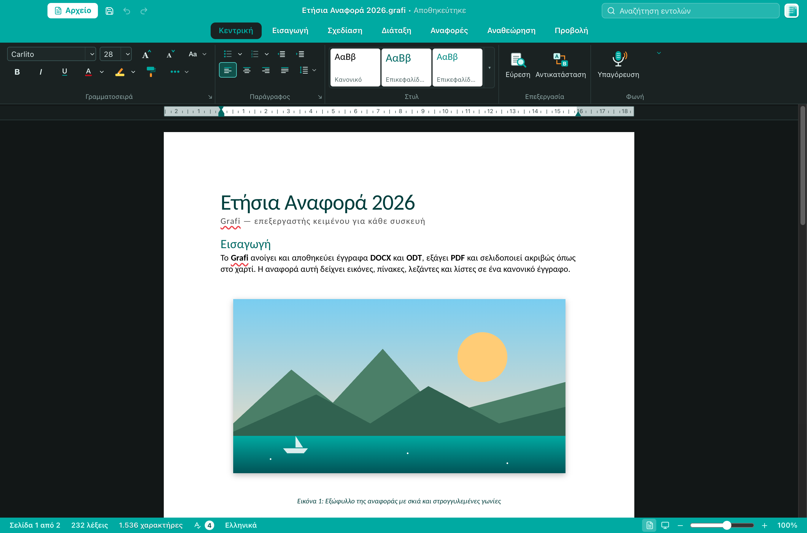
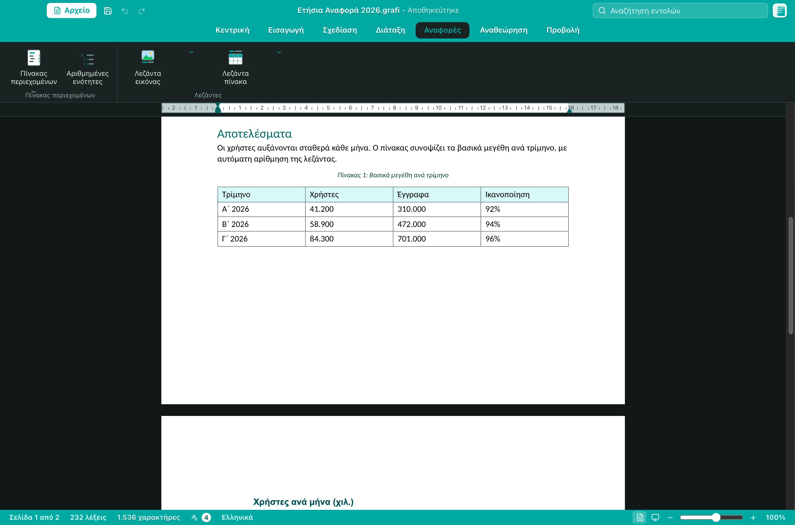
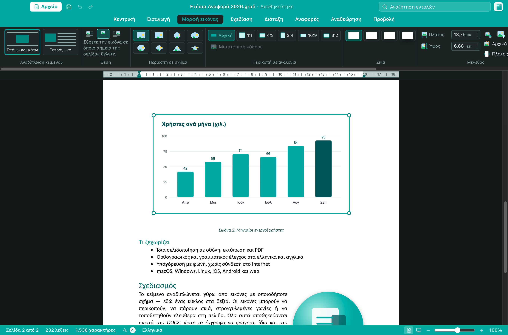
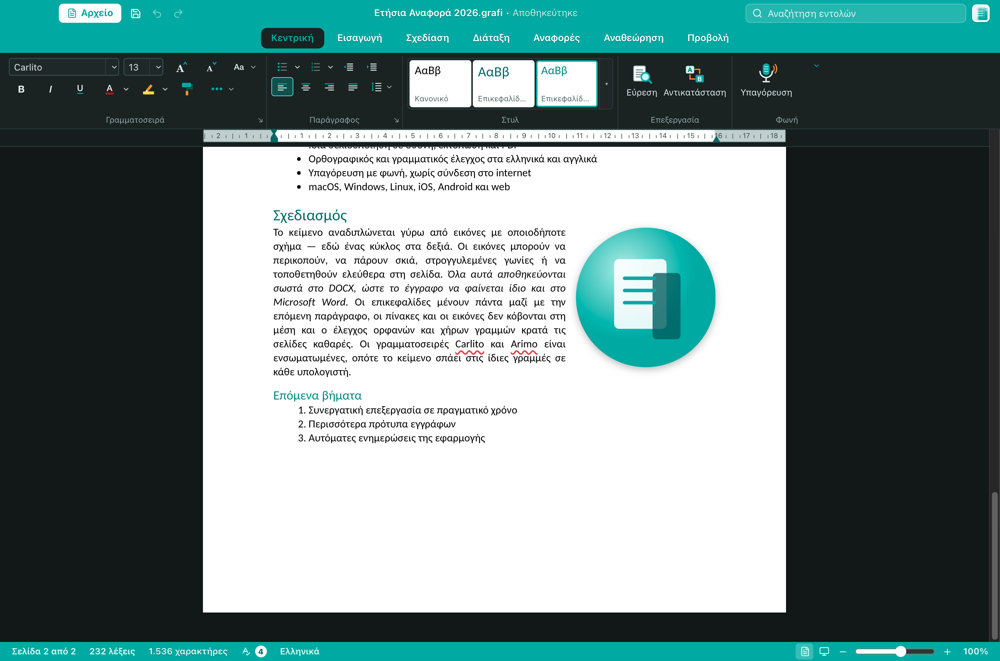
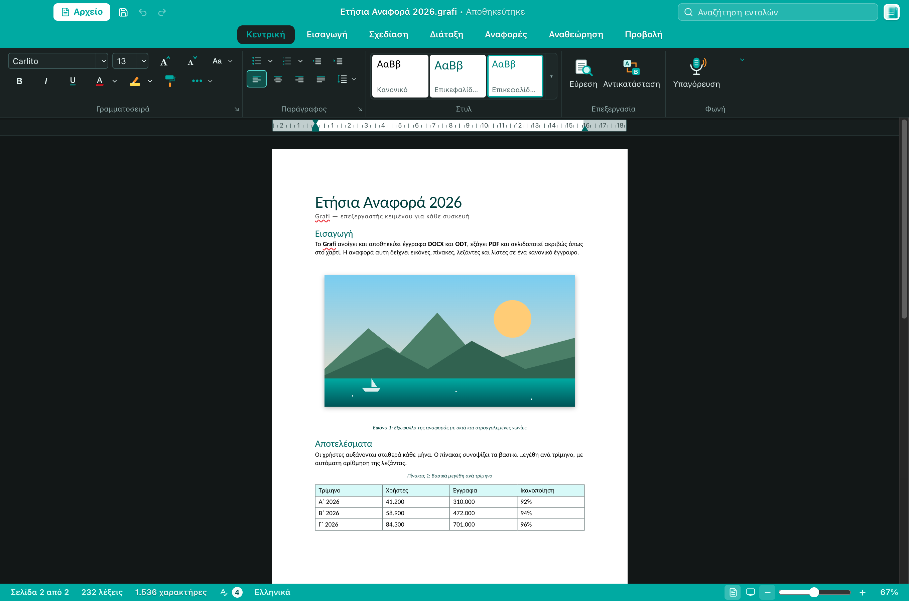
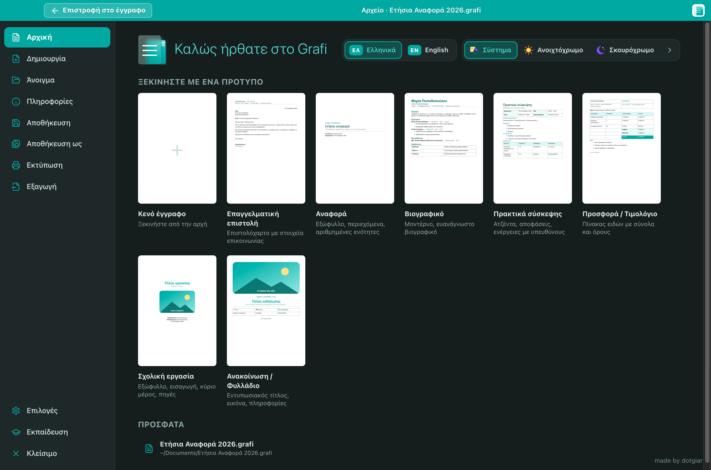
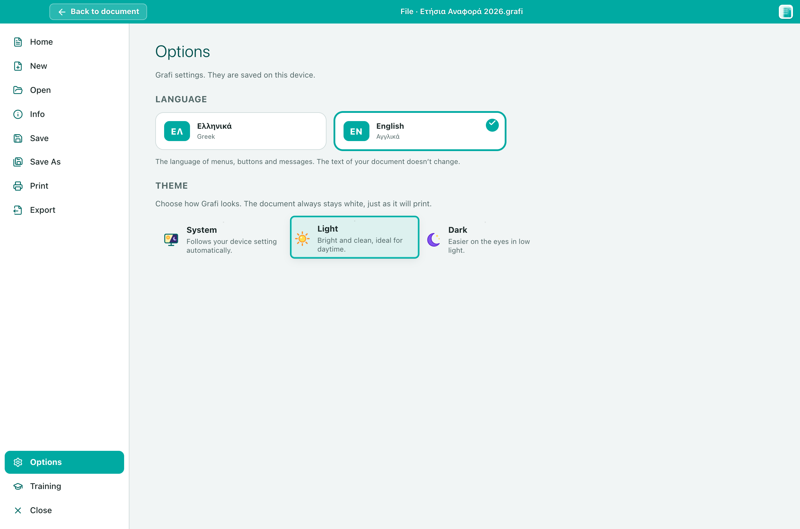
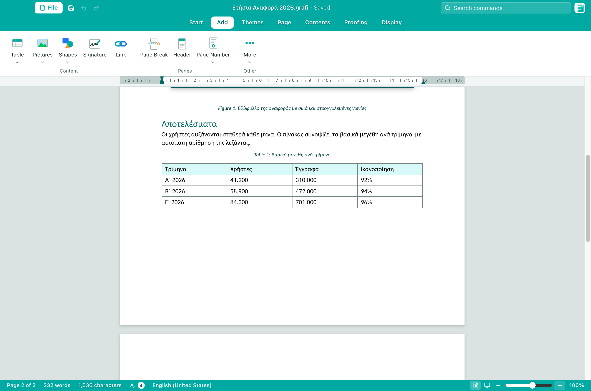

# Grafi — Screenshots

## English

**Grafi** is a word processor for macOS, Windows, Linux, iOS, Android and the web. It opens and saves
**DOCX** and **ODT**, exports **PDF** and prints, and what you see on screen is exactly what ends up on
paper: lines and pages break in the same place on screen, in print and in the PDF.

What we are building:

- **Real pages, not a long scroll.** A dedicated pagination engine keeps headings with the next paragraph,
  moves tables and pictures to the next page instead of cutting them, and handles widows and orphans.
- **Pictures that behave like in Word.** Wrap text top-and-bottom or around the picture, crop to a shape
  (circle, star, …) or to an aspect ratio, add shadows and rounded corners, drag it anywhere on the page.
- **Tables and auto-numbered captions.** “Figure 1”, “Table 1” are numbered automatically, above or below
  the object, and are translated with the interface language.
- **Proofing for Greek and English**, spelling and grammar, plus **offline voice dictation**.
- **Familiar ribbon**, a command search box, templates (letter, report, CV, minutes, invoice, flyer…),
  built-in training, and light / dark themes.
- **Word-compatible output.** The Carlito and Arimo fonts (metric-compatible with Calibri and Arial) are
  bundled, so documents wrap the same way on a computer without Microsoft Office.

## Ελληνικά

Το **Grafi** είναι επεξεργαστής κειμένου για macOS, Windows, Linux, iOS, Android και web. Ανοίγει και
αποθηκεύει **DOCX** και **ODT**, εξάγει **PDF** και εκτυπώνει. Ό,τι βλέπετε στην οθόνη είναι ακριβώς
αυτό που θα βγει στο χαρτί: οι γραμμές και οι σελίδες σπάνε στο ίδιο σημείο στην οθόνη, στην εκτύπωση
και στο PDF.

Τι φτιάχνουμε:

- **Πραγματικές σελίδες, όχι ένα ατελείωτο κύλισμα.** Η μηχανή σελιδοποίησης κρατά τις επικεφαλίδες μαζί
  με την επόμενη παράγραφο, μεταφέρει πίνακες και εικόνες στην επόμενη σελίδα αντί να τους κόβει, και
  ελέγχει τις ορφανές και χήρες γραμμές.
- **Εικόνες που συμπεριφέρονται όπως στο Word.** Αναδίπλωση κειμένου πάνω-κάτω ή γύρω από την εικόνα,
  περικοπή σε σχήμα (κύκλος, αστέρι…) ή σε αναλογία, σκιές, στρογγυλεμένες γωνίες, ελεύθερη τοποθέτηση.
- **Πίνακες και λεζάντες με αυτόματη αρίθμηση.** «Εικόνα 1», «Πίνακας 1», πάνω ή κάτω από το αντικείμενο,
  που μεταφράζονται μαζί με τη γλώσσα της εφαρμογής.
- **Ορθογραφικός και γραμματικός έλεγχος** στα ελληνικά και αγγλικά, και **υπαγόρευση με φωνή** χωρίς
  σύνδεση στο internet.
- **Γνώριμη κορδέλα**, αναζήτηση εντολών, πρότυπα (επιστολή, αναφορά, βιογραφικό, πρακτικά, προσφορά,
  φυλλάδιο…), ενσωματωμένη εκπαίδευση, ανοιχτόχρωμο και σκουρόχρωμο θέμα.
- **Συμβατότητα με το Word.** Οι γραμματοσειρές Carlito και Arimo (ίδιες διαστάσεις με Calibri και Arial)
  είναι ενσωματωμένες, ώστε το κείμενο να αναδιπλώνεται ίδια και σε υπολογιστή χωρίς Office.

---

### 1. Document with title, heading and picture · Έγγραφο με τίτλο, επικεφαλίδα και εικόνα

### 2. Table with auto-numbered caption · Πίνακας με λεζάντα που αριθμείται αυτόματα

The *Contents* tab inserts figure and table captions.
Η καρτέλα *Αναφορές* προσθέτει λεζάντες εικόνων και πινάκων.

### 3. Picture tools · Εργαλεία εικόνας

Text wrapping, position, crop to shape or ratio, shadow and size.
Αναδίπλωση κειμένου, θέση, περικοπή σε σχήμα ή αναλογία, σκιά και μέγεθος.

### 4. Text flowing around a round picture · Κείμενο γύρω από στρογγυλή εικόνα

### 5. Pagination, zoomed out · Σελιδοποίηση σε σμίκρυνση

### 6. File menu and templates · Μενού Αρχείο και πρότυπα

### 7. Options: language and theme · Επιλογές: γλώσσα και θέμα

### 8. English interface, light theme · Αγγλικό περιβάλλον, ανοιχτόχρωμο θέμα

Captions follow the interface language: “Figure 1”, “Table 1”.
Οι λεζάντες ακολουθούν τη γλώσσα της εφαρμογής: «Figure 1», «Table 1».

